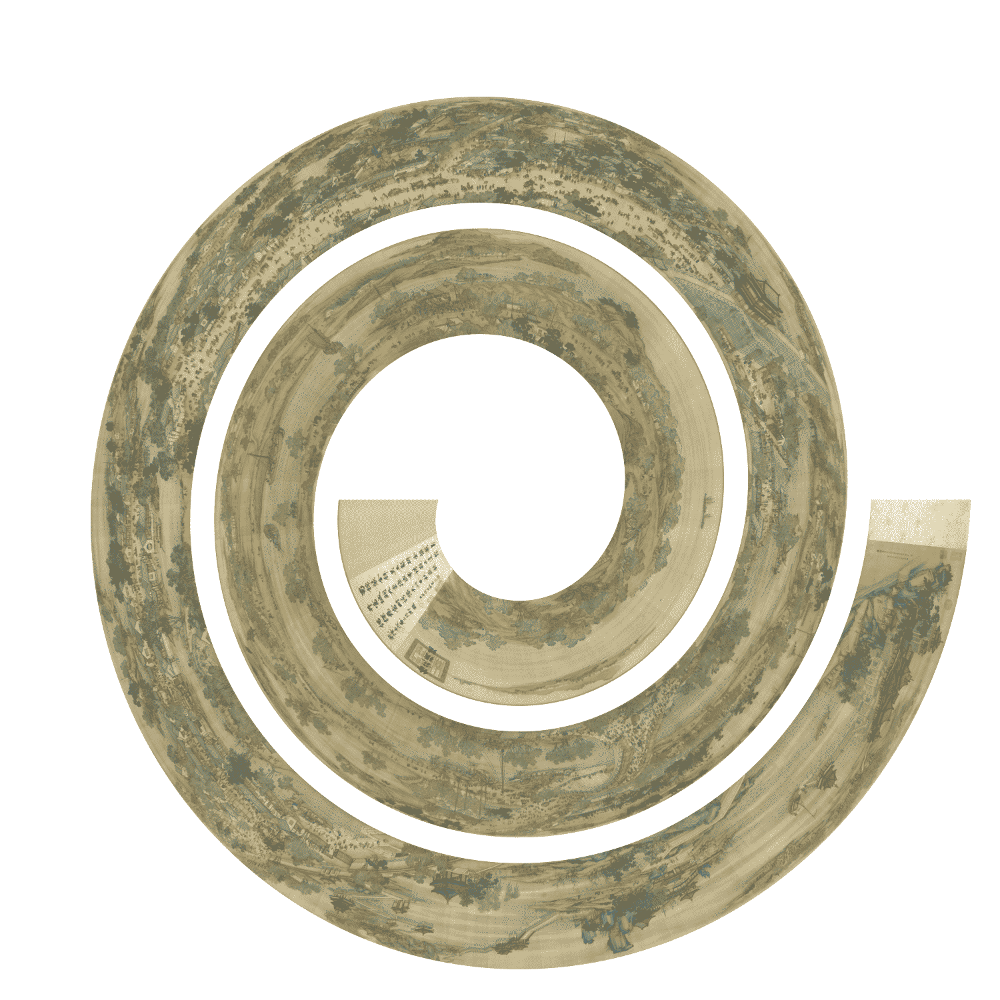

```{r, echo = FALSE}
library(knitr)
knitr::opts_chunk$set(
    error = FALSE,
    tidy  = FALSE,
    message = FALSE,
    warning = FALSE,
    fig.width = 7,
    fig.height = 7,
    fig.align = "center",
    fig.retina = 2
)
knitr::knit_hooks$set(pngquant = knitr::hook_pngquant)
knitr::opts_chunk$set(
  message = FALSE,
  dev = "ragg_png",
  fig.align = "center",
  pngquant = "--speed=10 --quality=30"
)
options(width = 100)
```


## Daily downloads of ggplot2

In previous vignettes, I have already demonstrated the visualization of daily
downloads of **ggplot** package. Here I make a more complete plot where I also
add text annotations and legends. As I mentioned in previous vignettes, the
plot visualizes log2-difference of the daily downloads to the mean downloads
of the current year, which is calculated as follows:

```{r}
library(spiralize)
library(lubridate)
library(ComplexHeatmap)
library(circlize)

df = readRDS(system.file("extdata", "ggplot2_downloads.rds", package = "spiralize"))
day_diff = as.double(df$date[nrow(df)] - df$date[1], "days")
year_mean = tapply(df$count, lubridate::year(df$date), function(x) mean(x[x > 0]))

df$diff = log2(df$count/year_mean[as.character(lubridate::year(df$date))])
df$diff[is.infinite(df$diff)] = 0
q = quantile(abs(df$diff), 0.99)  # adjust outliers
df$diff[df$diff > q] = q
df$diff[df$diff < -q] = -q
```

The downloads have weekly patterns, i.e. there are less downloads in the
weekends, thus in the spiral plot, I set the period as 52 weeks so that the
same week in different years can be aligned in the radical direction. Now since
each loop does not correspond a complete year, I additionally add annotation lines to
show years.

The polar coordiante system is split into 12 parts where each part corresponds to a month.

```{r, fig.width = 10}
spiral_initialize_by_time(xlim = range(df[, 1]), padding = unit(2, "cm"))
spiral_track(height = 0.8)
spiral_horizon(df$date, df$diff, use_bars = TRUE)

spiral_highlight("start",      "2015-12-31", type = "line", gp = gpar(col = 2))
spiral_highlight("2016-01-01", "2016-12-31", type = "line", gp = gpar(col = 3))
spiral_highlight("2017-01-01", "2017-12-31", type = "line", gp = gpar(col = 4))
spiral_highlight("2018-01-01", "2018-12-31", type = "line", gp = gpar(col = 5))
spiral_highlight("2019-01-01", "2019-12-31", type = "line", gp = gpar(col = 6))
spiral_highlight("2020-01-01", "2020-12-31", type = "line", gp = gpar(col = 7))
spiral_highlight("2021-01-01", "end",        type = "line", gp = gpar(col = 8))

s = current_spiral()
d = seq(15, 360, by = 30) %% 360
for(i in seq_along(d)) {
    foo = polar_to_cartesian(d[i]/180*pi, (s$max_radius + 1)*1.05)
    grid.text(month.name[i], x = foo[1, 1], y = foo[1, 2], default.unit = "native",
        rot = ifelse(d[i] > 0 & d[i] < 180, d[i] - 90, d[i] + 90), gp = gpar(fontsize = 10))
}

lgd = packLegend(
    Legend(title = "Difference to\nyearly average", at = c("higher", "lower"),
        legend_gp = gpar(fill = c("#D73027", "#313695"))),
    Legend(title = "Year", type = "lines", at = 2015:2021,
        legend_gp = gpar(col = 2:8))
)
draw(lgd, x = unit(1, "npc") + unit(10, "mm"), just = "left")
```

In the plot, I think there are the following messages that we can read:

1. There are less downloads at weekends compared to weekdays.
2. There are less downloads at the end of December and in Juanuary and Feburary.
3. The downloads are also less in July and August, but not as few as winters.
4. There are the highest number of downloads in November.

## Classification of central nervous system tumors

[Capper et. al., 2018](https://www.nature.com/articles/nature26000) studied subtype classification
of central nervous system tumors from DNA methylation data. In their dataset, there are 14 different 
tumor types (include controls) which are classified into 91 subtypes inferred from 2801 samples.

The most straightforward way is to visualize it as a heatmap which is composed by a list of rectangles.

```{r}
df = readRDS(system.file("extdata", "CNS_tumour_classification.rds", package = "spiralize"))
n = nrow(df)
spiral_initialize(xlim = c(0, n), scale_by = "curve_length")
spiral_track(height = 0.4)
spiral_rect(1:n - 1, 0, 1:n, 1, gp = gpar(fill = df$meth_col, col = NA))
spiral_track(height = 0.4)
spiral_rect(1:n - 1, 0, 1:n, 1, gp = gpar(fill = df$tumor_col, col = NA))

r1 = rle(as.vector(df$tumor_type))

for(i in seq_along(r1$lengths)) {
    spiral_text( (sum(r1$lengths[seq_len(i-1)]) + sum(r1$lengths[seq_len(i)]))/2, 0.5, r1$values[i], 
        facing = "curved_inside", nice_facing = TRUE)
}
```

The plot already looks good. However, one problem of that plot is I actually drawed 2801x2 rectangles,
which might results in that you can observe "interference wave lines" in the plot. This is because rectangles on spirals
are not real rectangles while polygons and edges of the neighbouring polygons cannot perfectly match.

In the previous code where I draw the text of tumor types, I used `rle()` function to group the tumor types.
Actually we can also use it for the heatmap because tumor types and methylation classes are already sorted and grouped,
so that we don't need to draw every single rectangle for every sample in a class, which we just draw one rectangle
that covers all samples in that class.

In the following code, I first define a function `spiral_rle()` for this purpose. This function
draws rectangles and adds labels on them.


```{r}
spiral_rle = function(x, col, labels = FALSE) {
    x = as.vector(x) # in case it is a factor
    r1 = rle(x)
    for(i in seq_along(r1$lengths)) {
        spiral_rect(sum(r1$lengths[seq_len(i-1)]), 0, sum(r1$lengths[seq_len(i)]), 1, gp = gpar(fill = col[r1$values[i]], col = NA))
    }

    if(labels) {
        for(i in seq_along(r1$lengths)) {
            spiral_text( (sum(r1$lengths[seq_len(i-1)]) + sum(r1$lengths[seq_len(i)]))/2, 0.5, r1$values[i], 
                facing = "curved_inside", nice_facing = TRUE)
        }
    }
}
```

I apply `spiral_rle()` to both tumor type track and methylation class track. Now the plot looks nicer. I also
add legends for methylation classes, grouped by tumor types.

```{r, fig.width = 13, fig.height = 7}
spiral_initialize(xlim = c(0, n), scale_by = "curve_length", 
    vp_param = list(x = unit(0, "npc"), just = "left"))
spiral_track(height = 0.4)
meth_col = structure(names = unique(df$meth_class), unique(df$meth_col))
spiral_rle(df$meth_class, col = meth_col)

spiral_track(height = 0.4)
tumor_col = structure(names = unique(as.vector(df$tumor_type)), unique(df$tumor_col))
spiral_rle(df$tumor_type, col = tumor_col, labels = TRUE)

lgd_list = tapply(1:nrow(df), df$tumor_type, function(ind) {
    Legend(title = df$tumor_type[ind][1], at = unique(df$meth_class[ind]),
        legend_gp = gpar(fill = unique(df$meth_col[ind])))
})

# here set max_height to the height of the image so that the legends are automatically arranged
lgd = packLegend(list = lgd_list, max_height = unit(7, "inch"))
draw(lgd, x = unit(1, "npc") + unit(2, "mm"), just = "left")
```

## First 5000 digits of &pi;

This example visualizes the first 5000 digits of &pi;. The digits of &pi; is from https://www.math.utah.edu/~alfeld/math/pi.html.

The following code first formats the &pi; digits as a vector of integers.

```{r}
pi_txt = readLines(system.file("extdata", "pi_10000_digits.txt", package = "spiralize"))
pi_txt = gsub("\\s", "", pi_txt)
pi_digits = strsplit(pi_txt, "")[[1]][-(1:2)]
pi_digits = as.integer(pi_digits)
pi_digits = pi_digits[1:5000]
head(pi_digits)
```

Then each digit is assigned to a color and the point size changes according to the value of the 
corresponding digit.

```{r}
# There are 30 loops in the spiral
spiral_initialize(c(0,5000), end = 365*30, scale_by = "curve")
spiral_track(height = 1, background = FALSE)
spiral_points(1:5000-0.5, 0.5, pch = 16, size = unit((pi_digits+1)/5, "mm"), 
    gp = gpar(col = pi_digits + 1))
```

The next plot shows another way to visualize &pi;. In the plot, two neighbour
digits of 1 are connected, e.g. a segment connects the first and the second 1,
then a second segment connects the third and the fourth 1, and so on. The segments are
assigned with random colors.

```{r}
spiral_initialize(c(0,5000), end = 365*30, scale_by = "curve")
spiral_track(height = 1, background = FALSE)

x = which(pi_digits == 1)
if(length(x) %% 2 == 1) x = x[-1]
n = length(x)
x1 = x[1:(n/2)*2 - 1]
x2 = x[1:(n/2)*2]

spiral_segments(x1 - 0.5, 0.5, x2 - 0.5, 0.5, 
    gp = gpar(col = rand_color(length(x1)), lwd = runif(length(x1), min = 0.5, max = 6)))
```

## Tree of life

This example visualizes tree of life from 3738 mammal organisms. The data is from
[Hedges et. al., 2015](http://www.biodiversitycenter.org/ttol).

To highlight different branches, I first convert the `phylo` object into a `dendrogram`
object, then I apply `dendextend::color_branches()` to color branches.

```{r}
library(ape)
tree = read.tree(system.file("extdata", "8.TTOL_mammals_unsmoothed.nwk", package = "spiralize"))
n = length(tree$tip.label)
spiral_initialize(xlim =c(0, n), scale_by = "curve_length")
spiral_track(background = FALSE)

dend = phylo_to_dendrogram(tree, log = TRUE) # the log-transformation is log10(x + 1)

at1 = c(0, 1, 10, 50, 150)
at2 = log10(at1 + 1)/dend_heights(dend)
spiral_yaxis(at = at2, labels = paste0(at1, "myr"), side = "both")

spiral_rect(TRACK_META$xlim[1], at2[1], TRACK_META$xlim[2], at2[2], gp = gpar(fill = "#EEEEEE", col = NA))
spiral_rect(TRACK_META$xlim[1], at2[2], TRACK_META$xlim[2], at2[3], gp = gpar(fill = "#DDDDDD", col = NA))
spiral_rect(TRACK_META$xlim[1], at2[3], TRACK_META$xlim[2], at2[4], gp = gpar(fill = "#CCCCCC", col = NA))
spiral_rect(TRACK_META$xlim[1], at2[4], TRACK_META$xlim[2], TRACK_META$ylim[2], gp = gpar(fill = "#BBBBBB", col = NA))

library(dendextend)
set.seed(111)
# note cutting by h is much faster than k for large dendrogram
dend = color_branches(dend, h = log10(70 + 1), col = rand_color)
spiral_dendrogram(dend)
```

It is also possible to directly use `spiral_phylo()`, setting the argument `group` will also color the branches.

```{r, eval = FALSE}
spiral_initialize(xlim =c(0, n), scale_by = "curve_length")
spiral_track()

cl = dendextend::cutree(dend, h = 70)
n_cl = length(unique(cl))
col = structure(names = unique(cl), rand_color(n_cl, luminosity = "bright", transparency = 0.8))
spiral_phylo(tree, group = col, group_col = col)
```

## Global temperature change

This example visualizes the global temperature change (relative to a base
line) since year 1880. The data is download from
https://datahub.io/core/global-temp. The temperature data has two sources. In
the example code, I use the data from "GCAG". In the spiral, each loop
contains 20 years.

```{r, fig.width = 9}
df = readRDS(system.file("extdata", "global_temperature.rds", package = "spiralize"))
df = df[df$Source == "GCAG", ]

spiral_initialize_by_time(xlim = range(df$Date), unit_on_axis = "months", period = "year",
    period_per_loop = 20, polar_lines_by = 360/20, vp_param = list(x = unit(0, "npc"), just = "left"))
spiral_track()
lt = spiral_horizon(df$Date, df$Mean, use_bar = TRUE)

spiral_text("1880-01-01", 0.5, "1880", gp = gpar(fontsize = 8))
spiral_text("1900-01-01", 0.5, "1900", gp = gpar(fontsize = 8))
spiral_text("1920-01-01", 0.5, "1920", gp = gpar(fontsize = 8))
spiral_text("1940-01-01", 0.5, "1940", gp = gpar(fontsize = 8))
spiral_text("1960-01-01", 0.5, "1960", gp = gpar(fontsize = 8))
spiral_text("1980-01-01", 0.5, "1980", gp = gpar(fontsize = 8))
spiral_text("2000-01-01", 0.5, "2000", gp = gpar(fontsize = 8))

lgd = horizon_legend(lt, title = "Temperature difference")
draw(lgd, x = unit(1, "npc") + unit(2, "mm"), just = "left")
```

## Sunspot cycle

This example visualizes the sunspot cycles start from year 1749. The
activity of sunspot has an average period of 11 years, thus in the spiral,
each loop contains 11 years. The data is from http://sidc.be/silso/datafiles
and the plot tries to reproduce
http://www.astrostatistics.org/projects/solar-cycle.

```{r, fig.width = 9}
df = readRDS(system.file("extdata", "sunspot.rds", package = "spiralize"))
date = as.Date(paste(df$year, df$month, "1", sep = "-"))

spiral_initialize_by_time(xlim = range(date), unit_on_axis = "months", period = "years", period_per_loop = 11, 
    polar_lines_by = 360/11, vp_param = list(x = unit(0, "npc"), just = "left"))
spiral_track()
col_fun = colorRamp2(seq(min(df$sunspot_number), max(df$sunspot_number), length = 3), c("blue", "white", "red"))
lt = spiral_horizon(date, df$sunspot_number, use_bar = TRUE)
lgd = horizon_legend(lt, title = "Sunspot count", format = "%.0f")
draw(lgd, x = unit(1, "npc") + unit(2, "mm"), just = "left")
```

## DNA sequence alignment

This example visualizes pairwise alignment of CDS (coding sequence) of the
gene _TP53_ between human and mouse. The alignment was obtained by
[blast](https://blast.ncbi.nlm.nih.gov/Blast.cgi).

First I read the blast result and format it as two vectors of letters.

```{r}
lines = readLines(system.file("extdata", "tp53_blast.txt", package = "spiralize"))
query = lines[seq(1, length(lines), by = 4)]
subject = lines[seq(3, length(lines), by = 4)]

query = gsub("^\\S+\\s+\\S+\\s+|\\s+\\S+$", "", query)
query = paste(query, collapse = "")
query = strsplit(query, "")[[1]]

subject = gsub("^\\S+\\s+\\S+\\s+|\\s+\\S+$", "", subject)
subject = paste(subject, collapse = "")
subject = strsplit(subject, "")[[1]]
```

The plot is mainly drawn with `spiral_text()` and `spiral_segments()`.

```{r, fig.width = 8, fig.height = 8}
n = length(query)
col = c("A" = 2, "T" = 4, "C" = 3, "G" = 7, "-" = "black")
spiral_initialize(xlim = c(0, n), start = 180, end = 360*6, scale_by = "curve")
spiral_track(height = 0.6)
spiral_text(1:n - 0.5, 0.3, query, facing = "inside", 
    gp = gpar(fontsize = 6, col = col[query]), just = "top",)
spiral_text(1:n - 0.5, 0.7, subject, facing = "inside", 
    gp = gpar(fontsize = 6, col = col[subject]), just = "bottom")
x = which(query == subject)
spiral_segments(x - 0.5, 0.35, x - 0.5, 0.65, gp = gpar(col = "#444444"))

spiral_track(height = 0.1, background = FALSE)
spiral_lines(TRACK_META$xlim, 0.5, gp = gpar(col = "#888888"))
at = seq(10, n, by = 10)
spiral_points(at, 0.5, pch = 16, size = unit(3, "pt"))
l = at %% 100 == 0
spiral_text(at[l] - 0.5, 1, paste0(at[l], "bp"), just = "bottom",
    facing = "inside", nice_facing=T, gp = gpar(fontsize = 6, col = "#444444"))
```

## Integrative visualization of methylation and histone modifications for BCAT2

This example visualizes DNA methylation and four histone modification signals along _BCAT2_ gene.
The data is from [UCSD Human Reference Epigenome Mapping Project](https://www.ncbi.nlm.nih.gov/geo/query/acc.cgi?acc=GSE16256)
and data for lung tissue is used.

```{r, fig.height = 8, fig.width = 10}
df_list = readRDS(system.file("extdata", "BCAT2_tracks.rds", package = "spiralize"))
spiral_initialize_by_gcoor(xlim = c(df_list$range[1, 2], df_list$range[1, 3]), end = 360*3,
    vp_param = list(x = unit(0, "npc"), just = "left"))

exons = df_list$exons
exons = exons[exons[, 8] == "exon", ]
spiral_track(height = 0.1, background = FALSE)
spiral_lines(TRACK_META$xlim, 0.5)
spiral_rect(exons[, 2], 0.1, exons[, 3], 0.9, gp = gpar(fill = "grey"))
spiral_segments(49314286, 0, 49314286, -1)
spiral_segments(49314286, -1, 49314286 - 200, -1, arrow = arrow(length = unit(2, "mm")))
spiral_text(49314286, -1, "TSS", hjust = -0.2, facing = "outside", gp = gpar(fontsize = 8))

spiral_segments(49298318, 0, 49298318, -1)
spiral_text(49298318, -1, "TES", hjust = -0.2, facing = "inside", gp = gpar(fontsize = 8))
spiral_points(49298318, -1, pch = 16)

meth = df_list$meth
spiral_track(height = 0.13)
meth_col = colorRamp2(c(0, 0.5, 1), c("blue", "white", "red"))
spiral_segments(meth[, 2], 0, meth[, 2], 1, gp = gpar(col = meth_col(meth[, 5])))

lgd_list = list(
    Legend(title = "Methylation", col_fun = meth_col)
)

i = 1
for(mark in grep("H3", names(df_list), value = TRUE)) {
    df = df_list[[mark]]
    i = i + 1
    spiral_track(height = 0.13)
    lt = spiral_horizon( (df[, 2] + df[, 3])/2, df[, 5], pos_fill = i,
        use_bars = TRUE, bar_width = df[, 3] - df[, 2])
    lgd_list = c(lgd_list, list(horizon_legend(lt, title = mark)))
}

spiral_lines(TRACK_META$xlim, 1)
at = seq(df_list$range[1, 3], df_list$range[1, 2], by = -1000)
labels = -(seq(df_list$range[1, 3], df_list$range[1, 2], by = -1000) - 49314286)
labels = paste0(labels/1000, "KB")
labels[labels == "11KB"] = ""
spiral_axis(at = at, labels = labels, labels_gp = gpar(fontsize = 8))

spiral_text(49297318, 0.5, "Methylation", hjust = 0, facing = "inside", gp = gpar(fontsize = 8), track_index = 2)
spiral_text(49297318, 0.5, "H3K4me1", hjust = 0, facing = "inside", gp = gpar(fontsize = 8), track_index = 3)
spiral_text(49297318, 0.5, "H3K4me3", hjust = 0, facing = "inside", gp = gpar(fontsize = 8), track_index = 4)
spiral_text(49297318, 0.5, "H3K9me3", hjust = 0, facing = "inside", gp = gpar(fontsize = 8), track_index = 5)
spiral_text(49297318, 0.5, "H3K27ac", hjust = 0, facing = "inside", gp = gpar(fontsize = 8), track_index = 6)

spiral_text(49315286, 0.5, "Methylation", hjust = 1, facing = "inside", gp = gpar(fontsize = 8), track_index = 2)
spiral_text(49315286, 0.5, "H3K4me1", hjust = 1, facing = "inside", gp = gpar(fontsize = 8), track_index = 3)
spiral_text(49315286, 0.5, "H3K4me3", hjust = 1, facing = "inside", gp = gpar(fontsize = 8), track_index = 4)
spiral_text(49315286, 0.5, "H3K9me3", hjust = 1, facing = "inside", gp = gpar(fontsize = 8), track_index = 5)
spiral_text(49315286, 0.5, "H3K27ac", hjust = 1, facing = "inside", gp = gpar(fontsize = 8), track_index = 6)

lgd = packLegend(list = lgd_list, max_height = unit(8, "in"))
draw(lgd, x = unit(1, "npc") + unit(2, "mm"), just = "left")
```


## Circadian gene expression

This example visualizes circadian expression for gene Elf1 in mouse. The data is from [Ray et al., 2020](https://www.science.org/doi/10.1126/science.aaw7365).
Normally, circadian expression data has a period of 24 hours. In this dataset, gene expression was measures every 3 hours for continuous 3 days.
Also in the data there are two categories: WT and KO.

```{r}
# values are log(FPKM)
expr = readRDS(system.file("extdata", "circadian_expression_mouse_Elf1.rds", package = "spiralize"))
expr
```

Heatmap is used to visualize the data.

```{r, fig.height = 8, fig.width = 10}
t = seq(0, 69, by = 3)
rg = range(expr)

col = colorRamp2(c(rg[1], mean(rg), rg[2]), c("blue", "#F7F7F7", "red"))
spiral_initialize(xlim = c(0, 69), period = 24, polar_lines_by = 45,
    vp_param = list(x = unit(0, "npc"), just = "left"))
spiral_track(ylim = c(0, 1), height = 0.7)
spiral_rect(t - 1.5, 0, t + 1.5, 0.5, gp = gpar(fill = col(expr[1:24])))
spiral_rect(t - 1.5, 0.5, t + 1.5, 1, gp = gpar(fill = col(expr[1:24 + 24])))
spiral_axis(at = t, labels = paste0(t, "h"), h = "bottom")

spiral_text(69 + 1.6, 0.25, "WT", just = "left", facing = "outside")
spiral_text(69 + 1.6, 0.75, "KO", just = "left", facing = "outside")

lgd = Legend(title = "log(FPKM)", col_fun = col)
draw(lgd, x = unit(1, "npc") + unit(2, "mm"), just = "left")
```

## GitHub commits

This example visualizes my GitHub daily commits from 2013-04-18 to 2021-07-01. The data is retrieved by the following code:

```{r, eval = FALSE}
repos = c("GlobalOptions", "GetoptLong", "circlize", "bsub", "pkgndep", "ComplexHeatmap", "EnrichedHeatmap", 
    "HilbertCurve", "gtrellis", "cola", "simplifyEnrichment", "InteractiveComplexHeatmap", "spiralize", "rGREAT")

df_all = data.frame(commits = numeric(0), date = character(0), repo = character(0))
for(r in repos) {
    # go to each repo folder
    setwd(paste0("~/project/development/", r))
    df = read.table(pipe("git log --date=short --pretty=format:%ad | sort | uniq -c"))
    colnames(df) = c("commits", "date")
    df$repo = r

    df_all = rbind(df_all, df)
}

df_all$date = as.Date(df_all$date)

start = min(df_all$date)
end = max(df_all$date)

d = start + seq(1, end - start + 1) - 1
n = numeric(length(d))
nl = lapply(repos, function(x) numeric(length(d)))
names(nl) = repos

for(i in seq_len(nrow(df_all))) {
    ind = as.double(difftime(df_all[i, "date"], start), "days") + 1
    n[ind] = n[ind] + df_all[i, "commits"]

    nl[[ df_all[i, "repo"] ]][ind] = nl[[ df_all[i, "repo"] ]][ind] + df_all[i, "commits"]
}

lt = list(d = d, n = n, nl = nl)
```

Here `d` is a vector of dates, `n` is a vector of daily commits of all packages, and `nl` is a list of vectors of commits of individual packages.


```{r, fig.width = 10, fig.height = 10}
lt = readRDS(system.file("extdata", "github_commits.rds", package = "spiralize"))
d = lt$d
n = lt$n
nl = lt$nl
```

I will use points to visualize commits. I first define a simple function to map between commits to point sizes.

```{r}
calc_pt_size = function(x) {
    pt_size = x
    pt_size[pt_size > 20] = 20
    pt_size[pt_size < 2 & pt_size > 0] = 2
    pt_size
}
```

Next I make the plot for the total commits and commits for individual pacakges.
It is actually very easy to see in which period the package was mostly actively developed.


```{r, fig.width = 16, fig.height = 16}
xlim = range(d)
pl = list()
pl[[1]] = grid.grabExpr({
    spiral_initialize_by_time(xlim, verbose = FALSE)
    spiral_track()
    spiral_points(d, 0.5, pch = 16, size = unit(calc_pt_size(n), "pt"))
    grid.text("All packages", x = 0, y = 1, just = c("left", "top"))
})

for(i in order(sapply(nl, sum), decreasing = TRUE)) {
    pl[[ names(nl)[i] ]] = grid.grabExpr({
        spiral_initialize_by_time(xlim, verbose = FALSE)
        spiral_track()
        spiral_points(d, 0.5, pch = 16, size = unit(calc_pt_size(nl[[i]]), "pt"))
        grid.text(names(nl)[i], x = 0, y = 1, just = c("left", "top"))
    })
}

library(cowplot)
plot_grid(plotlist = pl, ncol = 4)
```

## Fill spiral tracks with images

The RData file `doodle.RData` returns the object `img_list` which contains raster objects for 32 images.
First I merge them as a single image.

```{r}
load(system.file("extdata", "doodle.RData", package = "circlize"))
img = do.call(cbind, lapply(img_list, function(x) as.matrix(as.raster(x)[1:106, 1:150])))
img = as.raster(img)
dim(img)
```

Next simply call `spiral_track()` with `facing = "curved_inside"`:

```{r}
spiral_initialize(scale = "curve", start = 180, end = 360*3)
spiral_track(background = FALSE)
spiral_raster(0.5, 0.5, img, facing = "curved_inside")
```

The second example is the spiralization of the masterpiece "清明上河图" (Along the River During the Qingming Festival, https://en.wikipedia.org/wiki/Along_the_River_During_the_Qingming_Festival).
There are several versions in history. Here I use the one recreated in the Qing dynasty which is brighter and more colorful. The file `Along_the_River_During_the_Qingming_Festival_(Qing_Court_Version).jpg` is downloaded from https://zh.wikipedia.org/wiki/%E6%B8%85%E6%98%8E%E4%B8%8A%E6%B2%B3%E5%9C%96#/media/File:Along_the_River_During_the_Qingming_Festival_(Qing_Court_Version).jpg.

Note it takes very long time to generate this plot.

```{r, eval = FALSE}
image = "~/Downloads/Along_the_River_During_the_Qingming_Festival_(Qing_Court_Version).jpg"
spiral_initialize(start = 180, end = 360*3, scale_by = "curve")
spiral_track()
spiral_raster(0.5, 0.5, image, facing = "curved_inside")
```



## The COVID-19 daily increase

The COVID-19 daily increase is basically a time series data, thus it is natural to visualize it via spirals. I have implemented it
in a Shiny application (https://jokergoooo.shinyapps.io/covid19/, not available any more). The source code for generating this app is avaiable at https://gist.github.com/jokergoo/fa39ee3dcf20cbc13a31bbe93c3498fb.


<script src="jquery.min.js"></script>
<script src="jquery.sticky.js"></script>
<script>
$(document).ready(function(){
    $("#TOC").sticky({
        topSpacing: 0,
        zIndex:1000    
    })
    $("#TOC").on("sticky-start", function() {

        $("<p style='font-size:1.2em; padding-left:4px;'><a id='TOC-click'>Table of Content</a></p>").insertBefore($("#TOC ul:first-child"));
        $("#TOC-click").hover(function() {
            $(this).css("color", "#0033dd").css("cursor", "pointer");
            $("#TOC").children().first().next().show();
            $("#TOC").hover(function() {
                $(this).children().first().next().show();
            }, function() {
                $(this).children().first().next().hide();
                $("body").off("hover", "#TOC");
            })
        }, function() {
            $(this).css("color", "#0033dd");
        })
        $("#TOC").children().first().next().hide();

    })
    $("#TOC").on("sticky-end", function() {
        $("#TOC").children().first().remove();
        $("#TOC").children().first().show();
    })
});
</script>